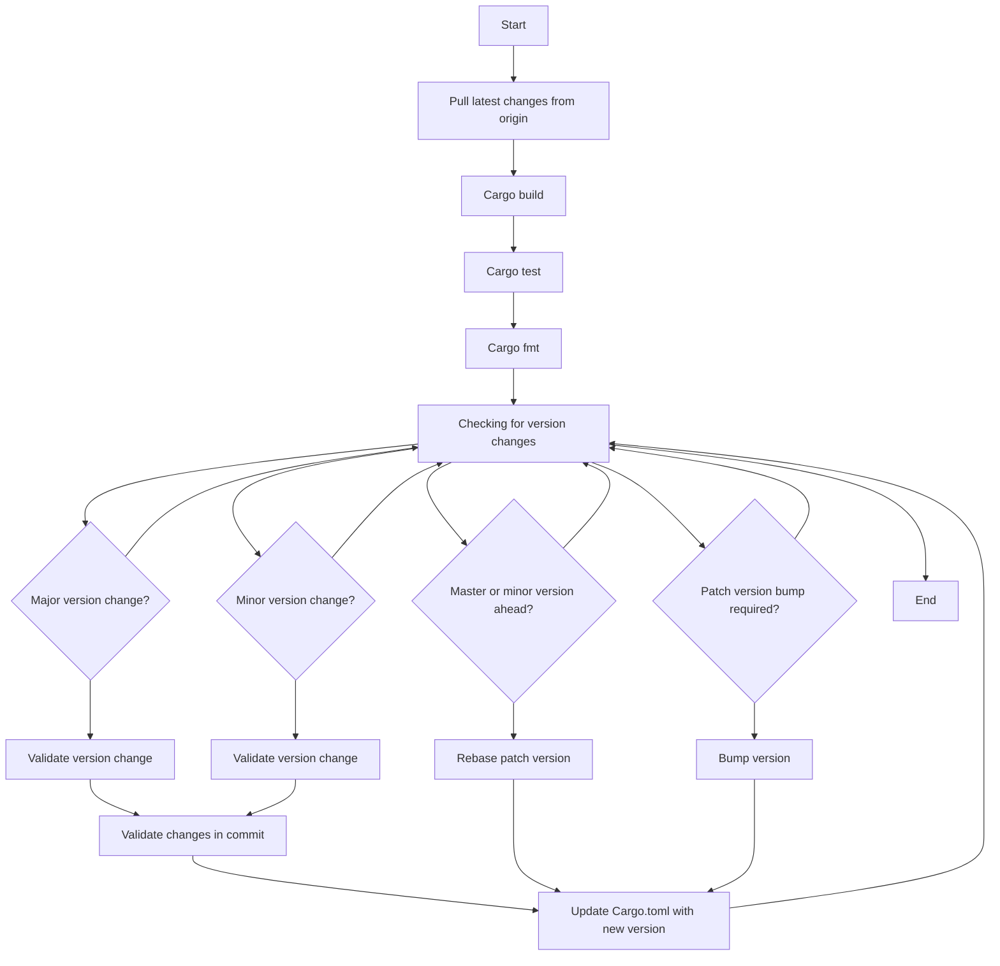

## Getting Started
### Start the app
```sh
make start
```

### Run Tests
```sh
make test
```

## Versioning Strategy
### Pre Push Git Checks
   The following actions are taken when code is push 

- Builds the project using cargo build and runs the tests using cargo test. (these are the same checks done by the CI)
- Checks the code formatting using cargo fmt.
- Compares the crate versions with the master branch and determines if a version update is required.
- If a version update is required, the script performs the following checks:
- If the major version was changed:
- Ensures that the major version was increased by only 1.
- Validates that the only change in the commit is to the version variable in the Cargo.toml file for the crate.
- Validates that the new version follows the format major.0.0.
- If the minor version was changed:
- Ensures that the minor version was increased by only 1.
- Validates that the only change in the commit is to the version variable in the Cargo.toml file for the crate.
- Validates that the new version follows the format major.minor.0.
- If the major or minor version in the master branch is ahead of the crate version, it rebases the patch version.
- Updates the crate's Cargo.toml file with the new version and commits the changes.

    Here's an diagram explaining the flow

